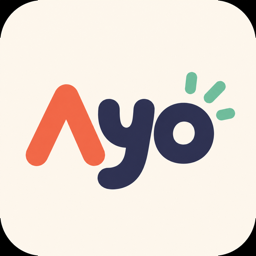

<div align="center">



# Ayo

**Ping your teammates from inside Codex and Claude.**

No Slack. No screenshots. No _"what branch are you on?"_

</div>

<!-- Demo GIF: record with scripts/demo.sh, save to docs/demo.gif, then uncomment:
<p align="center"></p>
-->

---

Ayo is the smallest possible sidechannel for developer attention. When the demo
breaks at 2am you don't want to alt-tab to Slack and re-explain your setup. You
want to send a teammate an **attention ping with your work context** (repo,
branch, changed files, the diff, the blocker) without leaving the tool you're
already thinking in.

```bash
ayo maya "demo deploy is cooked, can you tap in?"
ayo handoff kenny --with-diff
ayo team "we're cooked"
```

Or, from inside Codex / Claude Code:

> _"Ayo Maya with my current branch, changed files, and the blocker."_

The valuable unit isn't a message; it's **an attention ping with work context.**

## The live team board

`ayo board` is a glanceable HUD you leave up in a pane: who's online, who's
heads-down, **open handoffs**, and recent team activity, updating in real time:

```
  ⚡ Hack Midwest        3/4 online        ● live
  ──────────────────────────────────────────────────────
  ● wilson      2m   ayo@feat/auth      "wiring oauth"
  ● maya       now   web@main           "deploy is dead"
  ○ kenny      18m   —                  away
  ──────────────────────────────────────────────────────
  ⤷ open handoffs
    maya → team   deploy broken, need eyes   unclaimed 6m
  ──────────────────────────────────────────────────────
  recent
    now  maya   ▸ we're cooked, all hands
    2m   wilson ⤷ shipped auth
```

It only shows **team-relevant** activity: broadcasts and handoffs. Direct 1:1
pings stay private to the recipient's inbox.

## Use it from inside the agent

`ayo mcp install` registers Ayo's tools with Codex, Claude Code, and Cursor, so
your agent can ping, hand off, and read for you: `send_ayo`, `read_inbox`, `share_context`,
`create_handoff`, `team_status`, `set_status`, `resolve_ayo`. Just ask:

> _"Ayo Kenny that the deploy's cooked and include my current branch."_
> _"Hand this off to Maya with a summary of where I'm stuck."_
> _"Check my Ayo inbox and summarize anything urgent."_

It shares your CLI identity, so you log in once. (Privacy: handoffs only attach
the full diff when you ask, since a diff can contain uncommitted secrets.)

## How it works

Ayo isn't another chat app; it's **local infra that makes agent communication
ambient.** Install once, and your machine receives Ayos no matter where you are:
Codex, Claude Code, the terminal, the browser, whatever.

```
Relay ─▶ local Ayo daemon (ayod) ─▶ OS notification + local inbox   ← always works, real-time
                               ─▶ agent hooks surface unread at turn/session boundaries
                               ─▶ MCP / CLI read & reply on demand
```

- **The daemon receives.** A tiny background service holds one realtime
  connection to the relay and pops a native notification the instant an Ayo
  arrives. No `watch` pane to babysit.
- **The agents surface it.** `ayo hooks install` makes Claude Code
  (`SessionStart` + `UserPromptSubmit`) quietly drop your unread Ayos into the
  model at natural breakpoints, so the ping feels native when your agent picks
  back up. Codex's `notify` gets a toast fallback.
- **You reply on demand:** _"check my Ayos"_ inside the agent, or `ayo inbox`.

It's honest about what it knows: **sent ≠ delivered ≠ notified ≠ read.** A toast
firing tells the sender your machine buzzed, not that you looked.

## Quickstart

```bash
npm install -g @ayo-dev/cli

ayo init                        # one command: login, pick a sound, wire your
                                # agents, then fire a test ping you see + hear
```

`ayo init` ends by sending a real Ayo to yourself, so you experience the whole
thing — a native toast + your signature sound — in under a minute, no teammate
required. Flags: `--dry-run` (show what it'd do, change nothing), `--yes`
(non-interactive), `--only login,sound,daemon,mcp,hooks,test,team` (a subset).
`ayo uninstall` reverses the local wiring (your login + team stay).

<details><summary>…or set it up step by step</summary>

```bash
ayo login                       # GitHub device flow
ayo daemon install              # install ayod (your receiver) as a login service
ayo mcp install                 # use Ayo from inside Codex & Claude
ayo hooks install               # surface unread Ayos in-agent
```
</details>

```bash
ayo team create "Hack Midwest"  # prints a join code; teammates run `ayo join <code>`

ayo kenny "demo is cooked"      # → native toast on Kenny's machine
ayo board                       # live team HUD
```

`ayo daemon install` registers `ayod` as a **launchd** (macOS) / **systemd
--user** (Linux) service that starts on login and survives reboots. The daemon is
**boring and inspectable** on purpose:

```bash
ayo doctor          # environment + connectivity
ayo daemon status   # running? installed as a service?
ayo daemon logs
ayo daemon stop / uninstall
```

## The command surface

```bash
ayo maya "..."            # ping one person
ayo team "we're cooked"   # broadcast to everyone
ayo handoff maya --with-diff   # hand off: branch + changed files + diff + blocker
ayo status "locked in on demo" # set your status
ayo board                 # live team dashboard
ayo inbox                 # your Ayos
```

## Try it solo (one machine, no teammate)

The local relay has a dev stub that lets you be two people, with no second laptop or
GitHub account. `AYO_DIR` keeps each persona's files separate.

```bash
# Terminal 1: local relay (dev stub on)
cd packages/relay && npx wrangler dev --local --port 8787

# Terminals 2 & 3: run in each first:
export AYO_RELAY_URL=http://127.0.0.1:8787
alias ayo="node $(git rev-parse --show-toplevel)/packages/cli/dist/ayo.js"

# Terminal 2: you
export AYO_DIR=/tmp/ayo-you
ayo login --handle you && ayo team create "Self Test"   # copy the join code
ayo daemon start                                        # your receiver

# Terminal 3: your alter ego
export AYO_DIR=/tmp/ayo-pal
ayo login --handle pal && ayo join <CODE>
ayo you "does this actually work?"     # → Terminal 2 gets a native toast
```

Or run [`scripts/demo.sh`](scripts/demo.sh) for a scripted walkthrough.

## Packages

| Package | What it is |
|---|---|
| [`@ayo-dev/cli`](packages/cli) | The `ayo` command + the `ayod` background daemon |
| [`@ayo-dev/mcp`](packages/mcp) | MCP server exposing the Ayo tools to Codex/Claude |
| [`@ayo-dev/core`](packages/core) | Shared message schema, wire protocol, and types |
| [`relay`](packages/relay) | Cloudflare Worker + Durable Object: realtime fanout, one DO per team |

## Design notes

- [ADR 0001: Receive path is daemon-first, not MCP-first](docs/adr/0001-receive-path-daemon-first.md)
- [ADR 0002: Relay contract, message schema, and wire protocol](docs/adr/0002-relay-contract-and-message-schema.md)
- [Auth setup](docs/auth-setup.md) · [MCP setup](docs/mcp-setup.md) · [Follow-ups](docs/FOLLOWUPS.md)

## Development

```bash
pnpm install
pnpm -r build
pnpm dev:relay      # local Worker + Durable Object via wrangler
```

## License

MIT
